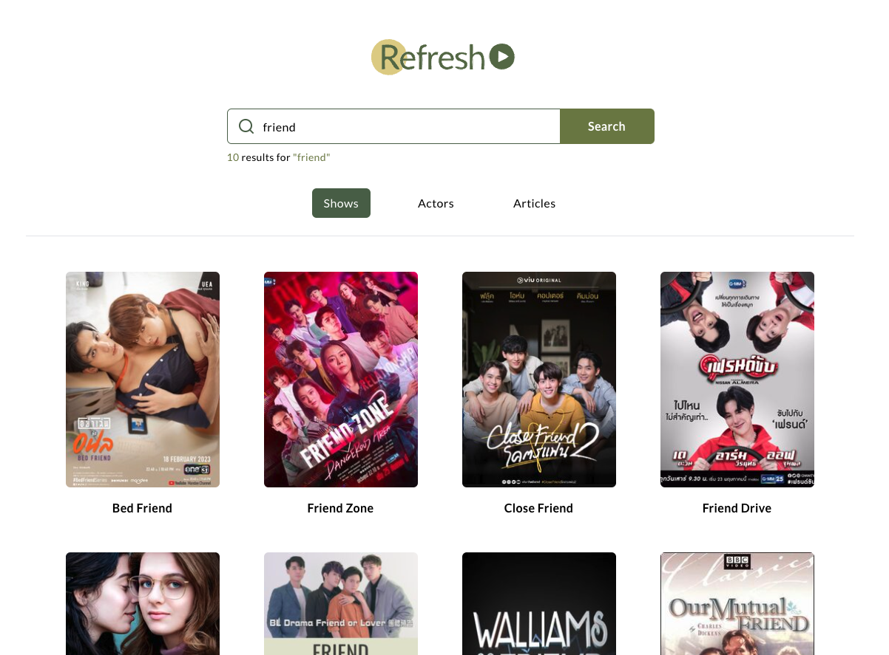

# Create Better TV Show Search Experience

## Decision Making

I am generally doing from analysis, design inspiration to come out with ideas. After that, I read coding base and then improve more UX interaction and styling for the application.

- Think about who our customers? TV lovers? Children or Adults

- Analysis existing problems and Write down issues

- [Write down note in the Notion](https://www.notion.so/jaylinxr/Note-Improve-better-TV-Show-App-0ded821918104e7382ba424e27f58027)

- Design inspiration for wireframe, color and font for use

- Looking into code base and think about anythings, such as props, css3 and interaction what I am going to design

- Considering about resuable components in React

- Any animation to attract users? Click, Loading and hover experience

## Font Choice

I think users want to see TV show because they want to relax after works so I decided to use `Lato` which is popular as the same as `Roboto` or `Open Sans` for the challenge.

On the other hand, serif is used to appear more classic and serious so I did not choose.

- [Lato](https://fonts.google.com/specimen/Lato)

## Color Choice

Green color represents nature. When everyone see to forest, I think the green color make them more comfortable feelings that reduce anxiety and stay calm.

- Primary: #53684D

- Secondary: #758245

- Hover/Interaction Effect: #E1D286

## letter-spacing

- Mobile: 0.05em

- Desktop: 0.025em

## Technical Use

- Create React App

- Tailwind CSS

- react-icons

- [Loading SVG](https://loading.io/)

## Demo

[Demo Link](https://refresh-db.vercel.app)

## Fix some issues with incapable version

I use Node version `18.3` so I have to adjust `react-start` to ` "start": "react-scripts --openssl-legacy-provider start"`

- [Node Version Issues](https://stackoverflow.com/questions/69692842/error-message-error0308010cdigital-envelope-routinesunsupported)

- [Upgrade React Script Version for TailwildCSS](https://stackoverflow.com/questions/64557697/tailwindcss-not-working-in-create-react-app)

## Extra Resources

- [Google Font in React](https://www.positronx.io/react-js-include-custom-fonts-google-fonts-tutorial/)

- [Color Inspiration](https://timesofindia.indiatimes.com/life-style/health-fitness/de-stress/7-relaxing-colors-and-how-they-affect-your-mood/articleshow/46946305.cms)

- [Peaceful Feeling at home](https://www.linkedin.com/pulse/7-peaceful-interior-colors-reduce-stress-cristina-baptista/)

- [Add Space in HTML](https://www.teachucomp.com/add-space-in-html-tutorial/#:~:text=Since%20there%20is%20no%20blank,five%20times%20between%20the%20words.)

## Future Plan

- Add `aria-label` for disable people

- Consider about space, some of parts have extra space in order to improve UX

- I saw somethings I could make resualbel component for future use

- Scrollable area for `Cast members` if I had enough time due to too many members costing too much reading time

- I am trying to fix image resolution issues. As you can see, there are many different size in the details' page.

## Getting Start

This project was bootstrapped with [Create React App](https://github.com/facebook/create-react-app).

In the project directory, you can run:

### `yarn start`

Runs the app in the development mode.\
Open [http://localhost:3000](http://localhost:3000) to view it in the browser.

The page will reload if you make edits.\
You will also see any lint errors in the console.

### `yarn test`

Launches the test runner in the interactive watch mode.\
See the section about [running tests](https://facebook.github.io/create-react-app/docs/running-tests) for more information.
